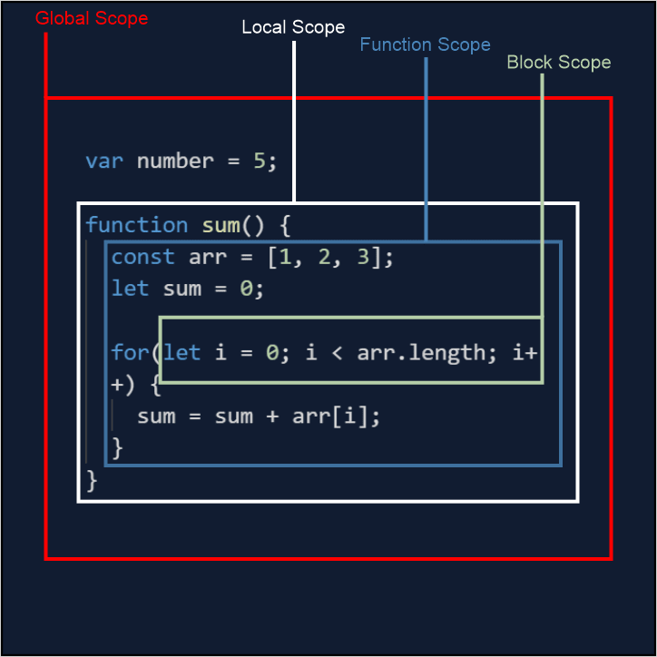

# Presentation-Scope-Js

# What is Scope in JavaScript:

Область действия в JavaScript относится к текущему контексту кода, который определяет доступность переменных для JavaScript. Существует два типа области видимости: локальная и глобальная: глобальные переменные — это переменные, объявленные вне блока. Локальные переменные — это переменные, объявленные внутри блока.

JavaScript has the following kinds of scopes:
· Global Scope : The default scope for all code running in script mode.
· Function Scope : The scope created with a function.
· Block Scope : This scope restricts the variable that is declared
inside a specific block, from access by the outside of the block.
· Module Scope :  The scope for code running in module mode.

# Global Scope:

В среде программирования глобальная область - это область, которая содержит и видна во всех других областях.

В клиентском JavaScript глобальной областью обычно является веб-страница, внутри которой выполняется весь код.

# Function Scope:

Всякий раз, когда вы объявляете переменную в функции, переменная видна только внутри функции. Вы не можете получить к нему доступ вне функции. var — это ключевое слово для определения переменной для доступа к области действия функции.

