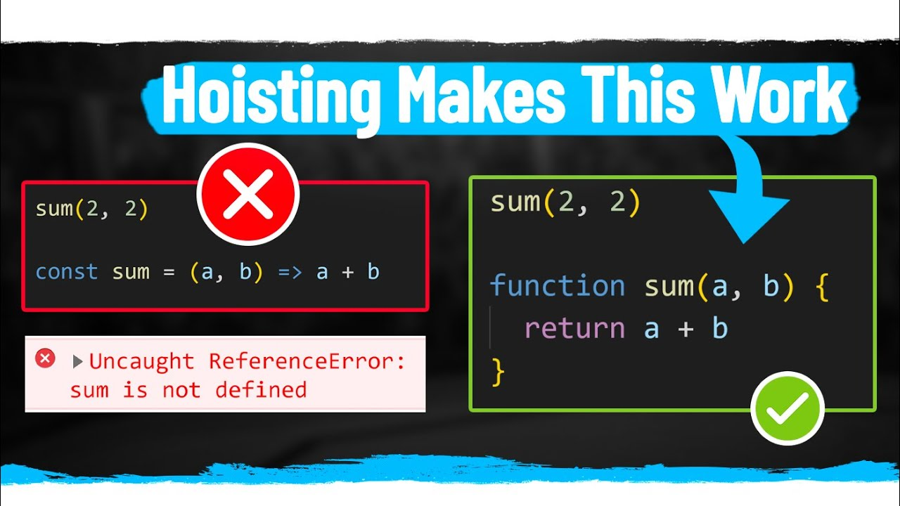

# Presentation-Scope-Js

# What is Scope in JavaScript:

Область действия в JavaScript относится к текущему контексту кода, который определяет доступность переменных для JavaScript. Существует два типа области видимости: локальная и глобальная: глобальные переменные — это переменные, объявленные вне блока. Локальные переменные — это переменные, объявленные внутри блока.

JavaScript has the following kinds of scopes:
· Global Scope : The default scope for all code running in script mode.
· Function Scope : The scope created with a function.
· Block Scope : This scope restricts the variable that is declared
inside a specific block, from access by the outside of the block.
· Module Scope :  The scope for code running in module mode.

# Global Scope:

В среде программирования глобальная область - это область, которая содержит и видна во всех других областях.

В клиентском JavaScript глобальной областью обычно является веб-страница, внутри которой выполняется весь код.

# Function Scope:

Всякий раз, когда вы объявляете переменную в функции, переменная видна только внутри функции. Вы не можете получить к нему доступ вне функции. var — это ключевое слово для определения переменной для доступа к области действия функции.

# Hoisting (Подъём):

Подъем JavaScript относится к процессу, при котором интерпретатор, кажется, перемещает объявление функций, переменных или классов в верхнюю часть их области видимости перед выполнением кода. Подъем не является термином, нормативно определенным в спецификации ECMAScript.

Возможность использовать значение переменной в ее области действия перед строкой, в которой она объявлена. («Подъем стоимости»)

Подъем JavaScript относится к процессу, при котором интерпретатор, кажется, перемещает объявление функций, переменных или классов в верхнюю часть их области видимости перед выполнением кода. Подъем не является термином, нормативно определенным в спецификации ECMAScript.

# Recursion (Рекурсия):

Рекурсия — это метод программирования, полезный в детстве, когда задачу можно естественным образом разделить на несколько похожих, но более простых задач. Или когда задачу можно упростить до простых действий плюс простой вариант той же задачи. Или, как мы увидим, для работы с определенными структурами данных.

# Clousere (Закрытие):

Замыкание — это комбинация объединенной (вложенной) функции со ссылками на ее окружающее состояние (лексическое окружение). Другими словами, замыкание дает вам доступ к области действия внешней функции из внутренней функции.

